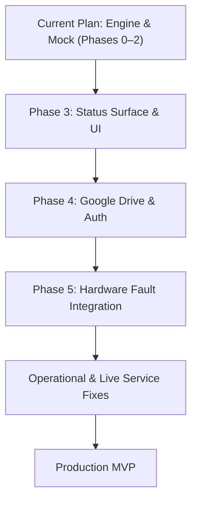

# Steps to MVP: Backup Engine, Status Surface & Production Readiness

This document outlines what is covered by the current plan ([`2026-08-21-backup-foundations-and-engine.md`](file:///Users/danielgreig/Desktop/navigation_app-backup-engine/docs/superpowers/plans/2026-08-21-backup-foundations-and-engine.md)), what remains in the pipeline from the [Backup & Status Spec](file:///Users/danielgreig/Desktop/navigation_app/docs/superpowers/specs/2026-08-21-drive-backup-and-status-surface-design.md), and the critical operational gaps that must be resolved before the app earns full MVP status for live Sunday services.

---

## 1. Current Plan Scope vs. Spec

The current implementation plan covers **Phases 0, 1, and 2** of the Backup & Status specification:

- **Phase 0 — Platform & Auth Spike:** Proves build/dependency impact on macOS, iOS, and Linux.
- **Phase 1 — Foundations:** Canonical JSON encoding, SHA-256 content hashing, `AppFault` taxonomy, revision metadata, `MockBackupTarget`, store mutation notifiers, `schemaVersion` validation, and atomic transactional restores via `RestoreJournal`.
- **Phase 2 — The Engine:** Push with post-write fork detection, 7-branch pull protocol, retry backoff, single-flight serialization, `BackupScheduler`, and startup rollback/singleton guards running against `MockBackupTarget`.

### What This Leaves on the Table:
The engine logic is verified in memory against a mock, but does not yet connect to Google Drive, does not render UI status indicators, and does not capture hardware failures.

TO DO: 
 2. Write Implementation Plan #2: Status Surface & Conflict UI (Phase 3).                                          \\
3.  Write Implementation Plan #3: Real Google Drive & Apple Auth (Phase 4).                                         
4. Write Implementation Plan #4: Hardware Reliability & Production Cue Fixes (Phase 5 + Live Ops items).   
---

## 2. Remaining Spec Phases

### Phase 3: The Status Surface & UI
- **AppBar Status Pill:** 5-state priority indicator (`red` non-conflict fault > `amber` conflict > `grey` not backed up > `amber` dirty pending > `green` backed up).
- **Error Log Popover:** Clickable popover displaying pinned active conditions, collapsible history via structured fingerprints `(domain, kind, operation, targetIdentity)`, dismiss controls (`x`), and relative time ladders.
- **Conflict Resolution Dialog:** Non-modal interface showing machine identity, timestamp, and diff summary with three explicit operator actions: *Use Remote Copy*, *Keep My Copy as New Revision*, or *Decide Later* (with per-revision prompt suppression).
- **Revision History Picker:** Visual list to preview and restore older snapshots from storage.
- **First-Run Device Naming:** Enforces explicit machine labeling; rejects invalid defaults (`localhost`, `iPad`, bare models, or duplicate names).
- **Lifecycle Integration:** Attaches `BackupScheduler` to `WidgetsBindingObserver` to pull on foreground and flush on background.
- **Production `localIsPristine`:** Comprehensive emptiness check across all 8 stores.

### Phase 4: Google Drive Target & Auth
- **`DriveBackupTarget`:** Real implementation of `BackupTargetAbstract` using Google Drive API v3 (`googleapis/drive/v3`).
- **OAuth Authentication:** `google_sign_in` and auth token handling on macOS and iOS.
- **Platform Entitlements & Configuration:** URL scheme callbacks (`CFBundleURLTypes`), macOS Keychain access groups (`$(AppIdentifierPrefix)com.google.GIDSignIn`), and Swift Package Manager linkage.
- **Drive Folder Identity:** Single root folder lookup/creation, persisting folder ID, handling trashed/deleted folder conditions, and deterministic file ordering (`trashed = false`, `orderBy createdTime desc`).
- **Automated Retention:** Executing `prune()` during periodic sweeps and pushes.

### Phase 5: Hardware Fault Integration
- Connect Roland V-160HD switcher socket disconnects, command timeouts, and protocol errors to `AppFault` (`FaultDomain.roland`).
- Connect Panasonic PTZ camera HTTP errors, timeouts, and ER protocol errors to `AppFault` (`FaultDomain.camera`).
- Surface device disconnections and hardware jams directly through the AppBar status pill.

---

## 3. Operational Landmines & MVP Gaps

The following architectural and operational issues in the existing codebase must be resolved before using the app during a live service:

### 1. Swallowed Hardware Responses (`onResponse: (_) {}`)
- **Location:** [`lib/widgets/multi_device_control_page.dart:325-560`](file:///Users/danielgreig/Desktop/navigation_app/lib/widgets/multi_device_control_page.dart#L325-L560)
- **Issue:** All device responses, errors, and timeouts from [`ServiceTab`](file:///Users/danielgreig/Desktop/navigation_app/lib/widgets/service_tab.dart), [`OperatorPanel`](file:///Users/danielgreig/Desktop/navigation_app/lib/widgets/operator_panel.dart), and [`PositionsTab`](file:///Users/danielgreig/Desktop/navigation_app/lib/widgets/positions_tab.dart) are routed into empty closures.
- **Impact:** If a camera fails to slew or the switcher drops a macro command during a service cue, the failure is swallowed silently. The cue advances, and the operator assumes the shot succeeded while the camera is pointed at the wrong location.
- **Fix:** Route all execution errors into the central status/fault reporting pipeline and surface visual failure states directly on the cue step.

### 2. Roland Switcher Socket Disconnect Desync
- **Location:** [`lib/services/roland_service.dart:1707-1719`](file:///Users/danielgreig/Desktop/navigation_app/lib/services/roland_service.dart#L1707-L1719)
- **Issue:** When the underlying TCP socket drops (`onError` or `onDone`), `RolandService` updates its internal state, but does not notify the UI's `_rolandConnected` `ValueNotifier`.
- **Impact:** The UI continues to report **Live** while the switcher connection is completely dead.
- **Fix:** Bind `_rolandConnected` directly to socket lifecycle events and reconnect attempts.

### 3. Offline Service Prep Lockout
- **Location:** [`lib/widgets/multi_device_control_page.dart:392-465`](file:///Users/danielgreig/Desktop/navigation_app/lib/widgets/multi_device_control_page.dart#L392-L465)
- **Issue:** If neither the Roland switcher nor any camera is connected, the app replaces the entire interface with a blocking "No devices connected" screen.
- **Impact:** Operators cannot edit service steps, assign people to positions, or review cue lists at home or before the equipment rack is powered on without switching to Demo Mode (which replaces production data with mock fixtures).
- **Fix:** Keep tabs accessible in an offline/disconnected state with clear connection indicators rather than a full-page modal lockout.

### 4. Lack of In-Flight Feedback on Service Steps
- **Location:** [`lib/widgets/service_tab.dart:116-237`](file:///Users/danielgreig/Desktop/navigation_app/lib/widgets/service_tab.dart#L116-L237)
- **Issue:** Firing a step sets `_currentStepIndex`, but provides no visual indication of command progress, hardware busy state, or success confirmation. PTZ camera preset recalls require 1–3 seconds of physical movement.
- **Impact:** Operators cannot tell if the command is currently executing, leading to accidental double-triggers or hesitation during live production.
- **Fix:** Add visual state indicators (e.g., executing spinner, completed checkmark, or failure badge) on the active cue item.

### 5. Volatile Sunday Roster Assignments
- **Location:** [`lib/widgets/service_tab.dart:60-63`](file:///Users/danielgreig/Desktop/navigation_app/lib/widgets/service_tab.dart#L60-L63)
- **Issue:** Participant-to-person assignments (`_participantAssignments`) are stored exclusively in ephemeral widget state.
- **Impact:** Navigating away, switching operator profiles, or app background termination on iPad erases the day's volunteer lineup.
- **Fix:** Persist active service participant assignments durably in `SharedPreferences`.

### 6. macOS App Sandbox File Export Path
- **Location:** [`lib/widgets/settings_dialog.dart:215-248`](file:///Users/danielgreig/Desktop/navigation_app/lib/widgets/settings_dialog.dart#L215-L248)
- **Issue:** Manual export/import suggests `$HOME/Documents/config.json`, which inside the macOS App Sandbox resolves inside the sandboxed container (`~/Library/Containers/...`).
- **Impact:** Non-technical operators cannot locate exported backup files via Finder.
- **Fix:** Use native file picker dialogs (`file_picker` or platform channel) to allow secure, user-directed export and import.

---

## 4. Prioritized Execution Checklist to MVP

| Priority | Area | Task | Deliverable |
|---|---|---|---|
| **P0** | Backup Engine | Execute plan `2026-08-21-backup-foundations-and-engine.md` | In-memory sync engine, atomic restores, canonical JSON |
| **P0** | Status Surface | Implement Phase 3 (Pill, Popover, Conflict UI) | Visible sync health, clickable error log, conflict picker |
| **P0** | Cloud Storage | Implement Phase 4 (Google Drive & OAuth) | Off-machine automated backups on Mac mini and iPad |
| **P1** | Hardware Reliability | Implement Phase 5 (Device Faults into Status Pill) | Real-time Roland & PTZ connection health in AppBar |
| **P1** | Core UX | Eliminate `onResponse: (_) {}` and fix disconnect desync | Error feedback on cue execution; truthful Live/Offline badge |
| **P1** | Core UX | Remove "No devices connected" full-screen lockout | Enable offline service prep and roster management |
| **P2** | Workflow | Add in-flight visual state & persist participant lineup | Feedback on cue movement; persistent Sunday lineup |
| **P2** | Utility | Native file picker for manual export/import | Intuitive file exports outside the App Sandbox |
